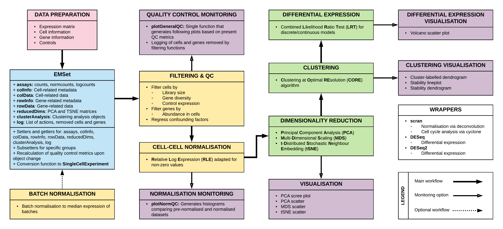

### Workflow Summary


### Installation
##### CRAN
* [devtools](https://cran.r-project.org/web/packages/devtools)
* [Matrix](https://cran.r-project.org/web/packages/Matrix)
* [ggplot2](https://cran.r-project.org/web/packages/ggplot2)
* [data.table](https://cran.r-project.org/web/packages/data.table)
* [dplyr](https://cran.r-project.org/web/packages/dplyr)
* [reshape2](https://cran.r-project.org/web/packages/reshape2)
* [Rtsne](https://cran.r-project.org/web/packages/Rtsne)
* [limSolve](https://cran.r-project.org/web/packages/limSolve)
* [ggbeeswarm](https://cran.r-project.org/web/packages/ggbeeswarm)
* [dynamicTreeCut](https://cran.r-project.org/package=dynamicTreeCut)
* [dendextend](https://cran.r-project.org/web/packages/dendextend)
* [RColorBrewer](https://cran.r-project.org/web/packages/RColorBrewer)

##### Bioconductor
* [Biobase](http://bioconductor.org/packages/release/bioc/html/Biobase.html)
* [BiocParallel](http://bioconductor.org/packages/release/bioc/html/BiocParallel.html)
* [scater](http://bioconductor.org/packages/release/bioc/html/scater.html)
* [scran](http://bioconductor.org/packages/release/bioc/html/scran.html)
* [DESeq](http://bioconductor.org/packages/release/bioc/html/DESeq.html)

#### Installing ASCEND
As this package is still under development, please use devtools to load the package.

```{r}
devtools::load_all("/Path/To/ASCEND")
```

You can also use devtools' install_github function to install the package. You can then load the package as normal.

```{r}
devtools::install_github("MB-Computational-Genomics-Lab/ASCEND")
library(ASCEND)
```

### Getting started
#### System Requirements
The amount of computational power and time required to process and analyse a single-cell RNASeq dataset is dependant on its size. Generally, ASCEND can comfortably analyse datasets that consist of up to 10,000 cells on a single machine. A single machine is defined as a desktop or laptop with 8GB of memory and four CPUs.

#### Configuring BiocParallel
This package makes extensive use of [BiocParallel](http://bioconductor.org/packages/release/bioc/html/BiocParallel.html) for its functions. Before you begin, you should register a BiocParallel backend in order to get the best performance out of this package.

Here are some example configurations:

#### Unix/Linux/MacOS (Single Machine)
```{r SetupNix}
library(BiocParallel)
ncores <- parallel::detectCores() - 1
register(MulticoreParam(workers = ncores, progressbar=TRUE), default = TRUE)
```

#### Windows (Single Machine - Quad-core system)
```{r SetupWin, eval = FALSE}
library(BiocParallel)
workers <- 3 # Number of cores on your machine - 1
register(SnowParam(workers = workers, type = "SOCK", progressbar = TRUE), default = TRUE)
```

### Preparing your data
This package has been tested with scRNASeq data generated by Chromium and DropSeq/FlowSeq. Data generated by other systems can be used with this package, provided the input is in the form of an expression matrix. The following section will describe how the data should be formatted.

##### Expression Matrix
The main source of input is an expression matrix, or a gene-barcode matrix containing transcript counts. They are usually produced at the end of single cell RNA-seq processing pipelines such as Cell Ranger and DropSeq.

In an expression matrix, each row represents a gene and each column represents a cell. The names of rows and columns will subsequently be named accordingly.

ASCEND is able to use any row and column names in the expression matrix, provided they abide by the following criteria:

1. Names should not repeat. If you have a list with repeats, you can make the names unique by using R's 'make.unique' function.
2. You should be able to identify which genes you would like to select as controls. This is why gene symbols or ENSEMBL transcript IDs should be used.
3. Cells from different batches, samples or sequencing runs should be given a numeric identifier at the end. eg. BARCODE-1, BARCODE-2, BARCODE-3.

##### Combining expression matrices from different batches
You can concatenate multiple expression matrices with the function *MergeExprsMtx*. Expression matrices generated with this method should then be normalised with the *NormaliseBatches* function. For pipelines such as Chromium's Cell Ranger, the native aggregation function should be used as it takes into account additional information such as individual reads.

#### Cell Information
Cell Information is a data frame containing cell identifiers, their associated batch identifier and additional information. ASCEND will automatically generate batch information for an expression matrix if none are provided. However, it will make the assumption that there is only one batch of cells in the expression matrix.

The Cell Information data frame should be structured as follows:

| cell_barcode | batch | ... |
|--------------|-------|-----|
| Cell1-1      | 1     | ... |
| Cell2-1      | 1     | ... |

Column 1 should hold the cell identifiers, and column 2 should hold batch information.

#### Gene Information
The Gene Information slot holds a data frame that contains the gene identifiers used in the expression matrix, in addition to their corresponding identifiers in other systems. ASCEND will also automatically generate batch information based on the expression matrix if none are provided. The Gene Information data frame can also hold additional information about genes.

The Gene Information data frame should be structured as follows:

| gene_identifier1 | ... | ... |
|------------------|-----|-----|
| GENE1            | ... | ... |
| GENE2            | ... | ... |

#### Controls
You must provide a list of gene identifiers linked to controls, if you would like to use ASCEND's filtering functions. These are generally mitochondrial and ribosomal genes. Spike-ins are also used as controls if they were included in the study.

Controls should be organised into a named list, and identifiers used should be present in the expression matrix.

#### Loading the data into ASCEND
Follow the vignettes [Introduction to ascend - Analysis of Single Cell Expression, Normalisation and Differential expression](vignettes/ascend_Tutorial.Rmd) and [Retina Ganglion Cells - A step-by-step ascend guide](vignettes/RGC_Tutorial) to learn about how to load your prepared data for use with ASCEND.

#### Contact
Please report any bugs on the Issues tracker of this repository. Feel free to send any other queries to a.senabouth@imb.uq.edu.au.
